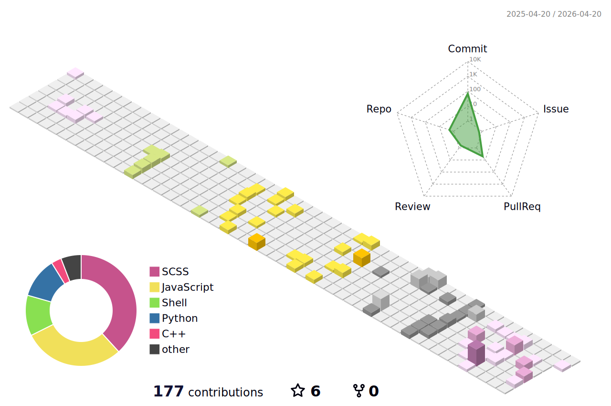

<!--  -->

## 🔭 Whoami
- PhD Student in Control Engineering/Theory @Kyushu Univ.
- Interest:
  - Robot Control
  - Vehicle Control
  - Networked Systems Control
    - Formation Control
    - Platooning Control
  - Network Analysis via Control-Theoretic Approaches

## 📚 Major Field
- Sampled-Data Control
- Nonlinear Control
- Sparse Optimization

## 👥 Activities
- 2023.04 - Present: OUXT Polaris (Maritime RobotX Challenge)
  - Autonomous drone software & perception developer
- 2022.10 - 2024.03: Hibikino-Musashi@Home (RoboCup@Home)
  - Developer of a human following system (Task: Carry My Luggage)
- 2020.08 - 2023.03: FUKUOKA NIWAKA (RoboMaster)
  - Developer of inverted pendulum robot & quadrotor control systems

<!---
Trigger-FK/Trigger-FK is a ✨ special ✨ repository because its `README.md` (this file) appears on your GitHub profile.
You can click the Preview link to take a look at your changes.
--->
